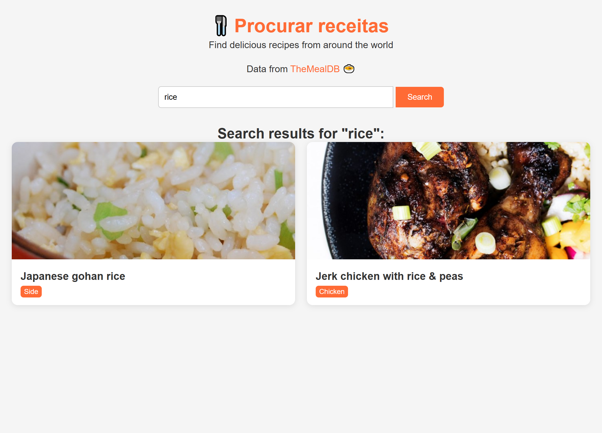

<h1 align="center">🍲 PROCURADOR DE RECEITAS RETRÔ 🍲</h1>

###



<h4 align="center"><a href="https://joao-enrique.github.io/procurar-receitas/">Confira o projeto aqui</a></h4>

👾 Bem-vindo ao **Procurador de Receitas Retrô** — uma aplicação simples e divertida para buscar receitas de forma rápida, com um visual nostálgico em **pixel art**. 🚀  

###

<h2 align="left">🕹️ Funcionalidades</h2>

###
- ✅ Pesquisa de receitas por nome ou ingrediente  
- ✅ Exibição de lista com resultados encontrados  
- ✅ Detalhes da receita (ingredientes e preparo)  
- ✅ Interface retrô em pixel art  
- ✅ Design responsivo  

###

<h2 align="left">🧠 Como funciona?</h2>

###
1. Digite o nome de um prato ou ingrediente no campo de busca.  
2. Clique em **Procurar**.  
3. Veja a lista de receitas encontradas.  
4. Clique em uma receita para visualizar detalhes completos.  

Simples, direto e no estilo retrô 🎨  

###

<h1 align="left">💾 Tecnologias utilizadas</h1>

###
<div align="left">
  
  
  
  
  
</div>

###

<h1 align="left">🧪 Como rodar?</h1>

###
<p align="left">1. Faça o clone do projeto:</p>

```bash

https://github.com/joao-enrique/procurador-receitas.git

```

<p align="left">2. Abra o <code>index.html</code> em seu navegador.</p>
<h1 align="left">👨‍💻 Estrutura</h1>

📁 recipe-finder-retro<br>
├── index.html # Estrutura principal<br>
├── style.css # Visual retrô/pixel art<br>
├── script.js # Lógica de busca e exibição<br>
└── README.md # Você está aqui!

<h1 align="left">🔮 Futuras melhorias</h1>

Filtro por categoria (sobremesas, massas, etc.) 🍰

Favoritar receitas ⭐

Modo offline com receitas salvas 💾

Animações 8-bit na interface 🎮

<h1 align="left">📬 Contato</h1> <p align="left">Feito com ❤️ por João Enrique.</p> <div align="left"> <a href="https://www.instagram.com/joao__dev/" target="_blank">  </a> <a href="https://www.linkedin.com/in/joao-enrique-dev/" target="_blank">  </a> <a href="https://www.youtube.com/@joao__dev" target="_blank">  </a> </div>

> “Encontre sua próxima refeição como se estivesse explorando um inventário retrô.” – Pixel Kitchen